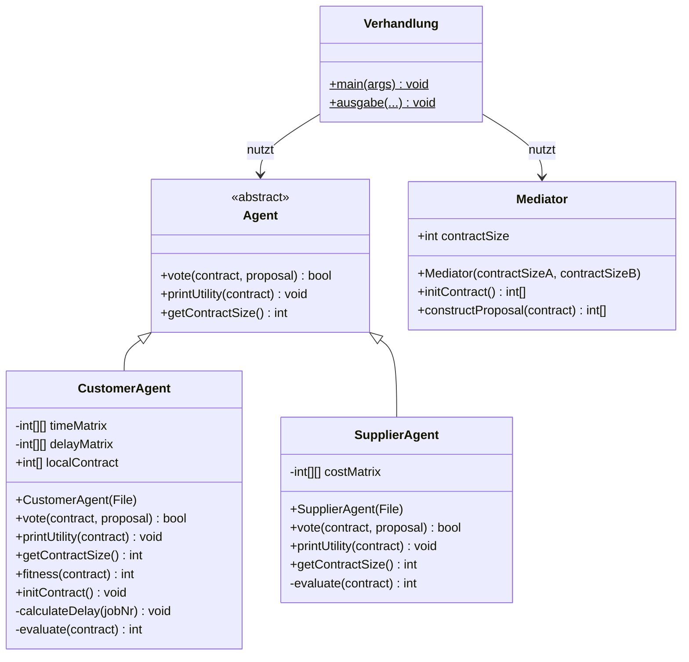
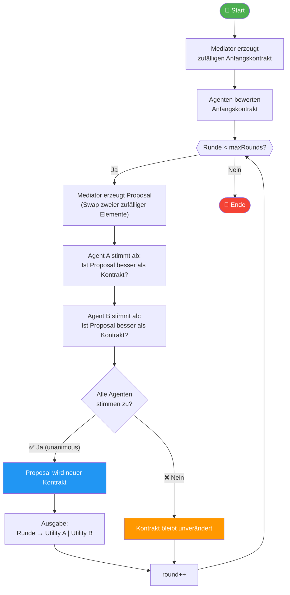
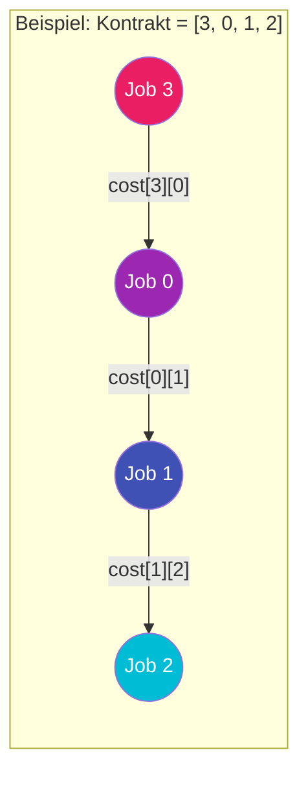
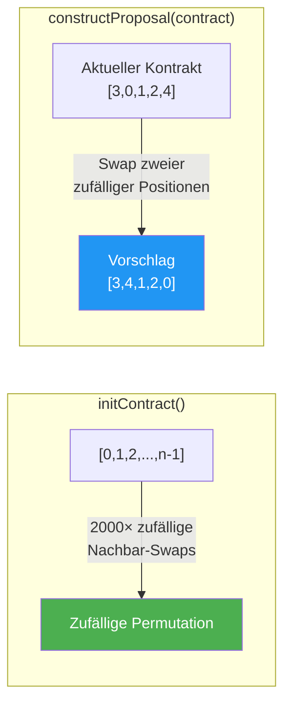
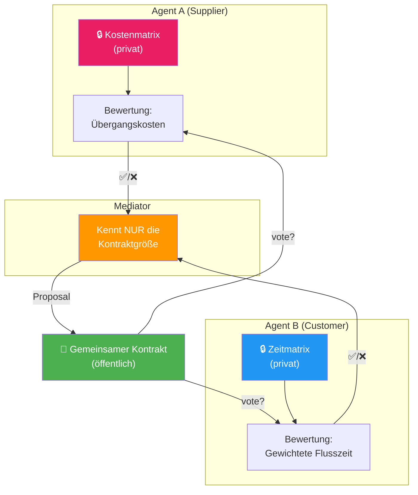

# 🤝 Multi-Agenten Verhandlungssystem

Ein agentenbasiertes Verhandlungssystem zur kooperativen Lösung kombinatorischer Optimierungsprobleme. Mehrere autonome Agenten verhandeln über einen gemeinsamen **Kontrakt** (eine Permutation von Jobs), wobei jeder Agent das Ergebnis anhand seiner eigenen, privaten Zielfunktion bewertet.

---

## 📁 Dateiübersicht

| Datei | Typ | Beschreibung |
|---|---|---|
| `Agent.java` | Abstrakte Klasse | Basisklasse für alle Agenten |
| `CustomerAgent.java` | Konkreter Agent | Bewertet Kontrakte aus **Flow-Shop-Scheduling**-Sicht |
| `SupplierAgent.java` | Konkreter Agent | Bewertet Kontrakte aus **TSP/Reihenfolge-Kosten**-Sicht |
| `Mediator.java` | Vermittler | Erzeugt Anfangskontrakte und schlägt Änderungen vor |
| `Verhandlung.java` | Hauptprogramm | Simuliert den gesamten Verhandlungsprozess |
| `GA_CUSTOMER.java` | Testprogramm | Standalone-Test des CustomerAgent mit Genetischem Algorithmus |
| `daten*.txt` | Problemdaten | Eingabedaten für Customer- und Supplier-Agenten |

---

## 🏗️ Architektur

### Klassendiagramm



---

## 🔄 Verhandlungsablauf

Der zentrale Algorithmus folgt einem **Mediator-basiertem Protokoll** mit einstimmiger Abstimmung:



### Ablauf in Pseudocode

```
kontrakt = mediator.initContract()           // Zufällige Permutation

FÜR jede runde VON 1 BIS maxRounds:
    proposal = mediator.constructProposal(kontrakt)   // Swap-Mutation
    stimmA   = agentA.vote(kontrakt, proposal)        // Besser für A?
    stimmB   = agentB.vote(kontrakt, proposal)        // Besser für B?

    WENN stimmA UND stimmB:                           // Einstimmigkeit!
        kontrakt = proposal                           // Akzeptiert
```

---

## 🧩 Die Agenten im Detail

### 🏭 SupplierAgent — Das TSP-Problem

Der SupplierAgent modelliert ein Problem ähnlich dem **Travelling Salesman Problem (TSP)**. Er besitzt eine **Kostenmatrix** `costMatrix[i][j]`, die die Kosten beschreibt, wenn Job `j` direkt nach Job `i` bearbeitet wird.



**Bewertung:** Summe der sequenziellen Übergangskosten:

```
evaluate([3, 0, 1, 2]) = cost[3][0] + cost[0][1] + cost[1][2]
```

**Ziel:** Minimierung der Gesamtkosten → optimale Reihenfolge finden.

---

### 📦 CustomerAgent — Das Flow-Shop-Scheduling-Problem

Der CustomerAgent löst ein **Flow-Shop-Scheduling-Problem**. Gegeben sind `n` Jobs, die auf `m` Maschinen in fester Reihenfolge bearbeitet werden müssen. Die `timeMatrix[job][machine]` enthält die Bearbeitungszeit jedes Jobs auf jeder Maschine.

```mermaid
gantt
    title Flow-Shop Beispiel (3 Jobs × 3 Maschinen)
    dateFormat X
    axisFormat %s

    section Maschine 1
    Job 0 :j0m1, 0, 3
    Job 1 :j1m1, 3, 5
    Job 2 :j2m1, 5, 9

    section Maschine 2
    Warten  :crit, w1, 0, 3
    Job 0 :j0m2, 3, 7
    Job 1 :j1m2, 7, 9
    Job 2 :j2m2, 9, 11

    section Maschine 3
    Warten  :crit, w2, 0, 7
    Job 0 :j0m3, 7, 9
    Job 1 :j1m3, 9, 13
    Job 2 :j2m3, 13, 15
```



Der CustomerAgent berechnet eine **Delay-Matrix** `delayMatrix[h][j]`, die angibt, wie lange Job `j` maximal warten muss, wenn Job `h` direkt davor eingeplant ist. Diese Matrix wird einmalig im Konstruktor vorberechnet.

#### Zwei Bewertungsfunktionen

| Methode | Formel | Beschreibung |
|---|---|---|
| `evaluate()` | `Σ delay[i-1][i] + Bearbeitungszeit letzter Job` | Makespan (Gesamtdurchlaufzeit) |
| `fitness()` | `Σ delay[i-1][i] × (n-i) + Σ aller Bearbeitungszeiten` | **Gewichtete Flusszeit** (nach Fink) — aktuell aktiv |

Die `fitness()`-Methode gewichtet Delays stärker, die **früh** in der Sequenz auftreten (Faktor `n-i`), da ein früher Delay alle nachfolgenden Jobs beeinflusst.

---

### 🤝 Mediator — Der Vermittler

Der Mediator kennt **keine** Zielfunktionen der Agenten. Er arbeitet blind und kennt nur die Kontraktgröße.



| Methode | Funktionsweise |
|---|---|
| `initContract()` | Erzeugt eine zufällige Permutation durch 2000 zufällige Nachbar-Swaps |
| `constructProposal()` | Kopiert den aktuellen Kontrakt und **tauscht zwei zufällige Positionen** |

> **Hinweis:** In einer auskommentierten Variante werden stattdessen nur **benachbarte** Elemente getauscht — eine konservativere Nachbarschaftsstruktur.

---

## ⚠️ Das Stagnationsproblem

Der Kommentar in `Verhandlung.java` beschreibt das zentrale Problem des Systems:

```mermaid
graph TD
    subgraph "Stagnation"
        S1["Anfangskontrakt ist zufällig\n→ zunächst leicht verbesserbar"] --> S2["Agenten finden lokal gute Lösung"]
        S2 --> S3["Jeder neue Proposal verbessert\nzwar einen Agenten..."]
        S3 --> S4["...verschlechtert aber den anderen"]
        S4 --> S5["❌ Kein Konsens mehr möglich\n→ Verhandlung stagniert"]
    end

    subgraph "Verschärfung mit mehr Agenten"
        M1["2 Agenten: Beide müssen zustimmen"] --> M2["3 Agenten: Alle drei müssen zustimmen"]
        M2 --> M3["5 Agenten: Alle fünf müssen zustimmen"]
        M3 --> M4["📉 Wahrscheinlichkeit einer\neinstimmigen Verbesserung sinkt exponentiell"]
    end

    style S5 fill:#f44336,color:#fff
    style M4 fill:#FF5722,color:#fff
```



### Mögliche Lösungsansätze (aus dem Code-Kommentar)

| Ansatz | Beschreibung |
|---|---|
| 🎲 **Akzeptanz von Verschlechterungen** | Agenten akzeptieren auch schlechtere Proposals mit einer vom Mediator vorgegebenen Mindestrate (ähnlich Simulated Annealing) |
| 💡 **Agenten schlagen Kontrakte vor** | Agenten bringen eigene Vorschläge ein statt nur zu reagieren |
| 🏗️ **Gemeinsame Konstruktion** | Agenten bauen kooperativ einen Kontrakt auf |
| 📊 **Mehrere Proposals pro Runde** | Der Mediator generiert mehrere Alternativen pro Runde |
| 🔧 **Alternative Konstruktionsmechanismen** | Andere Mutationsoperatoren (z.B. Insert, Inversion statt Swap) |
| 💰 **Ausgleichszahlungen** | Agenten kompensieren sich gegenseitig (nur bei monetären Zielfunktionen möglich) |

---

## 📊 Datendateien

Die Probleminstanzen folgen einem Namensschema:

```
daten{Szenario}{Variante}{Agententyp}_{Jobs}[_{Maschinen}].txt
```

| Datei | Agent | Jobs | Maschinen | Beschreibung |
|---|---|---|---|---|
| `daten3ACustomer_200_10.txt` | Customer | 200 | 10 | Szenario 3A: 200 Jobs auf 10 Maschinen |
| `daten3ASupplier_200.txt` | Supplier | 200 | — | Szenario 3A: 200×200 Kostenmatrix |
| `daten3BCustomer_200_20.txt` | Customer | 200 | 20 | Szenario 3B: 200 Jobs auf 20 Maschinen |
| `daten3BSupplier_200.txt` | Supplier | 200 | — | Szenario 3B: 200×200 Kostenmatrix |
| `daten4ACustomer_200_5.txt` | Customer | 200 | 5 | Szenario 4A: 200 Jobs auf 5 Maschinen |
| `daten4ASupplier_200.txt` | Supplier | 200 | — | Szenario 4A: 200×200 Kostenmatrix |
| `daten4BCustomer_200_5.txt` | Customer | 200 | 5 | Szenario 4B: 200 Jobs auf 5 Maschinen |
| `daten4BSupplier_200.txt` | Supplier | 200 | — | Szenario 4B: 200×200 Kostenmatrix |

### Datenformat

**Customer-Dateien:**
```
200          ← Anzahl Jobs
10           ← Anzahl Maschinen
6 8 10 7 ... ← Bearbeitungszeiten Job 0 (pro Maschine)
9 6 6 3 ...  ← Bearbeitungszeiten Job 1
...
```

**Supplier-Dateien:**
```
200            ← Dimension (n×n Matrix)
11 84 35 7 ... ← Kostenzeile 0 (Übergangskosten von Job 0 zu allen anderen)
39 94 25 85 ... ← Kostenzeile 1
...
```

---

## 🔑 Kernkonzepte

### Was ist ein Kontrakt?

Ein **Kontrakt** ist eine **Permutation** von Job-Indizes `[0, 1, 2, ..., n-1]`, die eine Bearbeitungsreihenfolge festlegt. Beispiel für 5 Jobs:

```
Kontrakt: [3, 0, 4, 1, 2]
→ Erst Job 3, dann Job 0, dann Job 4, dann Job 1, dann Job 2
```

Jeder Agent bewertet diese **gleiche** Permutation, aber mit **unterschiedlichen** Zielfunktionen — das erzeugt den Verhandlungsbedarf.

### Autonomie & Private Information



Kein Agent sieht die Daten oder Bewertung des anderen — sie kommunizieren ausschließlich über **Ja/Nein-Abstimmungen** auf Proposals des Mediators.

---

## 🚀 Ausführung

```bash
# Kompilieren
javac *.java

# Verhandlung starten
java Verhandlung

# Standalone Customer-Agent testen
java GA_CUSTOMER
```

> **Hinweis:** Die Datendateien werden relativ aus `data/` geladen. Stelle sicher, dass ein `data/`-Verzeichnis mit den `.txt`-Dateien existiert.
