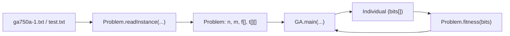
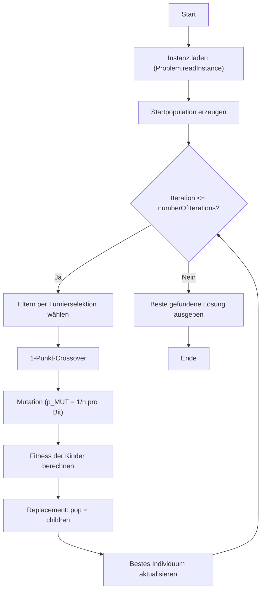

# GA Facility Location

Dieses Projekt implementiert einen **genetischen Algorithmus (GA)** zur Lösung eines **Uncapacitated Facility Location Problems (UFLP)**.

Ziel ist es, eine Menge von Standorten (Facilities) zu öffnen, sodass die Summe aus:

- Fixkosten der geöffneten Standorte und
- Transportkosten von jedem Kunden zum jeweils günstigsten geöffneten Standort

minimal wird.

## Projektstruktur

- `GA.java` – Einstiegspunkt, GA-Hauptschleife (Initialisierung, Selektion, Crossover, Mutation, Replacement)
- `Individual.java` – Repräsentation einer Lösung (Bitvektor), genetische Operatoren, Fitness-Aufruf
- `Problem.java` – Einlesen der Instanzdatei und Berechnung der Zielfunktion
- `ga750a-1.txt` – große Problem-Instanz (wird aktuell in `GA.java` standardmäßig verwendet)
- `test.txt` – kleine Testinstanz zum schnellen Verstehen/Debuggen

## Visualisierung

### Komponentenübersicht



### Ablauf des genetischen Algorithmus



## Wie der Code funktioniert

### 1) Daten einlesen (`Problem.readInstance`)

`Problem.java` lädt eine Instanzdatei und initialisiert:

- `n`: Anzahl Facilities
- `m`: Anzahl Kunden
- `f[n]`: Fixkosten pro Facility
- `t[n][m]`: Transportkosten Facility → Kunde

### 2) Repräsentation einer Lösung (`Individual`)

Eine Lösung ist ein Bitvektor `bits` der Länge `n`:

- `bits[i] = 1` → Facility `i` ist geöffnet
- `bits[i] = 0` → Facility `i` ist geschlossen

Wichtige Methoden:

- `initialize()` – zufällige Startlösung (mindestens eine Facility offen)
- `mutation()` – Bit-Flip mit Wahrscheinlichkeit `p_MUT = 1 / n`
- `crossover(...)` – 1-Punkt-Crossover
- `fitness()` – berechnet Kosten über `Problem.fitness(bits)`

### 3) Fitness / Zielfunktion (`Problem.fitness`)

Die Fitness ist hier eine **Kostenfunktion** (kleiner ist besser):

1. Summe der Fixkosten aller geöffneten Facilities
2. Für jeden Kunden: minimale Transportkosten zu einer geöffneten Facility

Gesamtkosten = 1 + 2.

### 4) Genetischer Algorithmus (`GA.main`)

Standardparameter:

- Population: `popSize = 100`
- Iterationen: `numberOfIterations = 10000`

Ablauf:

1. Instanz laden (`ga750a-1.txt`)
2. Startpopulation erzeugen
3. Pro Iteration:
   - Eltern per Turnierselektion wählen (`selection`)
   - Crossover + Mutation
   - Fitness der Kinder berechnen
   - Population vollständig durch Kinder ersetzen
   - Bestes Individuum aktualisieren
4. Beste gefundene Lösung ausgeben

Hinweis: Da minimiert wird, bevorzugt die Selektion das Individuum mit **kleinerer** Fitness.

## Lokales Ausführen (ohne Docker)

Voraussetzung: JDK 17 oder neuer.

```bash
javac *.java
java GA
```

## Eingabedatei-Format

Beispiel (`test.txt`):

```txt
FILE: test.txt
5 5 0
1 30 58 81 75 72 82
...
```

Interpretation:

- Zeile 1: Kommentar/Name
- Zeile 2: `n m 0` (0 = keine Kapazitäten)
- Danach je Standort eine Zeile:
  - Standort-ID
  - Fixkosten
  - `m` Transportkosten (zu jedem Kunden)

## Docker

### Image bauen

```bash
docker build -t ga-facility-location .
```

### Container ausführen

```bash
docker run --rm ga-facility-location
```

Der Container kompiliert und startet automatisch `GA`, nutzt also standardmäßig die in `GA.java` eingestellte Instanzdatei (`ga750a-1.txt`).
